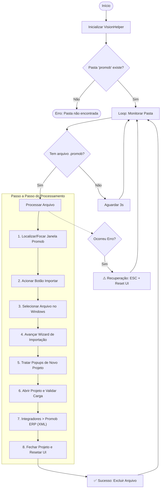

# Automação Promob

**Automação robótica (RPA) de alta resiliência e controle remoto distribuído para processamento de projetos no software Promob.**

O projeto automatiza o ciclo completo de processamento de projetos 3D do Promob: monitoramento de diretórios, importação de arquivos `.promob`, preenchimento resiliente de wizards, geração de exportações XML para ERP (com suporte a longos tempos de carregamento) e reset seguro de interface. 

Além disso, conta com uma **arquitetura de rede distribuída** que permite monitorar e controlar a automação remotamente através de conexões TCP.

---

## 📸 Interface do Usuário

O painel operador foi construído em WPF seguindo princípios modernos de design (Dark Theme, feedback visual em tempo real e separação clara de contextos):

| 🖥️ 1. Seleção de Modo (`StartupWindow`) | 🔐 2. Autenticação (`LoginWindow`) | 📊 3. Painel de Controle (`MainWindow`) |
|:---:|:---:|:---:|
|  |  |  |
| Permite definir se a instância rodará localmente, como servidor TCP na rede ou como cliente remoto. | Restringe as ações de controle (Iniciar/Parar/Atualizar) a operadores autenticados. | Console de logs em tempo real, contadores de performance (sucessos/erros) e controles manuais. |

---

## 📐 Fluxo de Funcionamento e Ciclo de Vida



---

## ⚙️ Arquitetura e Visão Técnica (Foco no Recrutador)

Se você é um desenvolvedor ou recrutador avaliando este projeto, aqui estão as principais soluções de engenharia adotadas:

### 1. Motor de Automação de Interface (RPA Híbrido)
Diferente de automações simples baseadas apenas em cliques em coordenadas fixas, este robô utiliza uma abordagem de **3 níveis de resiliência** para interagir com o Promob:
* **Nível 1: Windows UI Automation (UIA3 via FlaUI)**: O robô inspeciona a árvore de acessibilidade nativa do sistema operacional para identificar botões, campos de texto e menus pelos seus identificadores únicos. Isso torna a automação independente da resolução de tela ou posicionamento da janela.
* **Nível 2: Cliques em Coordenadas Dinâmicas**: Caso um componente específico do Promob (como o canvas 3D) não exponha seus elementos na árvore UIA, o robô calcula as coordenadas relativas do elemento com base no bounding rectangle da janela e executa um clique físico simulado.
* **Nível 3: Fallback de Teclado (Keyboard Simulation)**: Como última camada de segurança, o robô emula atalhos de teclado de baixo nível (`Space`, `Enter`, `Tab`, `ESC`) caso a interface pare de responder aos eventos UIA.

### 2. Visão Computacional Multimodal (AI-Assisted Vision)
* Para lidar com telas de aviso inesperadas ou renderizações 3D complexas no Promob, o projeto integra o `VisionHelper.cs`.
* Ele realiza capturas de tela e utiliza **LLMs Multimodais (Gemini 2.0 Flash via API OpenRouter)** como um oráculo visual para validações dinâmicas que seriam impossíveis com regras estáticas (ex: verificar se um projeto foi completamente renderizado ou se há um modal de aviso com padrão visual não documentado).

### 3. Arquitetura de Rede Distribuída (Servidor-Cliente TCP)
O projeto conta com um módulo de comunicação via sockets TCP (`Network/PromobServer.cs` e `Network/PromobClient.cs`) operando com mensagens JSON estruturadas (`Network/WsMessage.cs`):
* **Modo Servidor**: O robô executa fisicamente na máquina onde o Promob está instalado, abrindo uma porta TCP para transmitir logs estruturados de tempo real e estatísticas de processamento.
* **Modo Cliente**: Outros computadores na mesma rede podem conectar-se ao servidor. O cliente recebe e exibe o console de logs em tempo real e permite que operadores enviem comandos remotos para Iniciar, Parar ou Atualizar a automação.
* **Modo Local**: Execução clássica standalone (automação e interface na mesma máquina).

### 4. Proteção de Memória e Recursos do Sistema (Watchdog)
* **Gerenciamento de Processos**: A classe `Automation/PromobWatchdog.cs` monitora a saúde do processo `Promob.exe`, identificando travamentos de renderização (responsividade) e vazamento de memória.
* **Limpeza de Janelas Órfãs**: Evita a poluição de recursos fechando janelas secundárias abertas pelo Promob (como caixas de diálogo abertas após a geração do XML).

---

## 🛡️ Resiliência e Autocura (Self-Healing)
Em ambientes de produção executando 24/7, falhas externas são inevitáveis. O projeto foi blindado com técnicas de resiliência:
* **Preservação da Área de Trabalho (`Utils/NativeClipboard.cs`)**: A importação de caminhos de arquivos é feita injetando dados na área de transferência. O robô faz backup do clipboard do usuário antes de iniciar o processo e o restaura ao fim, evitando que o usuário perca suas informações copiadas.
* **Bypass de Atualizações (`Promob/PromobUpdater.cs`)**: O Promob frequentemente exibe modais de atualização de catálogos no startup. O robô intercepta esses modais, descarta-os de forma segura e prossegue com o processamento.
* **Modo de Recuperação (Recovery Mode)**: Se qualquer etapa falhar ou um popup inesperado bloquear a tela, o robô cancela a operação atual, envia uma sequência de `ESC`, limpa a área de trabalho 3D e reseta o Promob para o estado inicial para não travar os próximos arquivos da fila.

---

## 🛠️ Stack Técnica
* **Linguagem**: C# (.NET 8.0)
* **Framework UI**: WPF (Windows Presentation Foundation) para a Central de Controle.
* **Bibliotecas de Automação**:
  - `FlaUI.UIA3`: Acesso de baixo nível à árvore de automação do Windows.
  - `System.Drawing.Common`: Capturas de tela e manipulação de imagens.
* **Comunicação e Configuração**:
  - `System.Net.Sockets`: Comunicação de rede síncrona/assíncrona de baixo overhead.
  - `System.Text.Json`: Serialização e desserialização de payloads de rede.
  - `DotNetEnv`: Carga segura de variáveis de ambiente.
* **Inteligência Artificial**: API OpenRouter (integração multimodal com o modelo `gemini-2.0-flash`).

---

## 🚀 Como Configurar e Rodar

### Pré-requisitos
1. Sistema Operacional **Windows 10 ou 11**.
2. [SDK .NET 8.0](https://dotnet.microsoft.com/download/dotnet/8.0) instalado.
3. Promob instalado.

### Inicialização Rápida
1. Clone este repositório:
   ```bash
   git clone https://github.com/seu-usuario/PromobAutomacao.git
   cd PromobAutomacao
   ```
2. Crie um arquivo `.env` na raiz do projeto contendo:
   ```env
   # API Key do OpenRouter/Gemini para a IA visual do VisionHelper (Opcional)
   GEMINI_API_KEY=sua_chave_aqui

   # Configurações de pastas (Se omitido, usa pastas padrão criadas na área de trabalho)
   PASTA_PROMOB=C:\Users\Nome\Desktop\promob
   PASTA_XML=C:\Users\Nome\Desktop\xml
   ```
3. Execute o projeto via PowerShell/CMD na pasta raiz:
   ```powershell
   dotnet run
   ```

---

## 📁 Estrutura Detalhada do Projeto

```text
PromobAutomacao/
├── Program.cs              # Ponto de entrada do executável e loop de monitoramento
├── AppMode.cs              # Configuração dos modos de inicialização do robô (Local, Servidor, Cliente)
├── AutomacaoEstado.cs      # Modelo de persistência e estatísticas de processamento
├── VisionHelper.cs         # Integração de Visão Computacional com Gemini 2.0 Flash
├── MainWindow.xaml / .cs   # Janela principal do operador (Interface WPF)
├── StartupWindow.xaml / .cs# Splash screen de carregamento e seleção de modo de rede
├── LoginWindow.xaml / .cs  # Tela de autenticação e controle de acessos do operador
├── Promob/                 # Regras de Negócio e Passos da Automação do Promob
│   ├── PromobWorkflow.cs        # Orquestrador das 8 etapas principais
│   ├── PromobConfig.cs          # Dicionário de IDs de elementos UIA, nomes e caminhos
│   ├── PromobWindowHelper.cs    # Lógica de localização e foco em janelas/popups
│   ├── PromobUpdater.cs         # Bypass resiliente de telas de atualização
│   ├── PromobImportador.cs      # Automação do wizard de arquivos .promob
│   ├── PromobCarregadorProjeto.cs# Tratamento de ambiente 3D e validação de carregamento
│   ├── PromobExportadorErp.cs   # Processamento e exportação do XML ERP
│   ├── PromobFecharProjeto.cs   # Encerramento seguro de projetos e reset de tela
│   ├── PromobRecuperacao.cs     # Tratador de diálogos inesperados (Recovery Mode)
│   └── PromobExportException.cs # Exceções de negócio para falhas na geração ERP
├── Automation/             # Ferramentas Genéricas de Automação de Interface
│   ├── WindowFinder.cs          # Motor de busca UIA resiliente com cache e fallback
│   ├── InteractionHelper.cs     # Ações de Clique, Foco, Digitação e Polling robustos
│   └── PromobWatchdog.cs        # Monitoramento e controle do processo Promob.exe
├── Network/                # Comunicação Socket TCP entre Computadores da Rede
│   ├── NetworkSettings.cs       # Configurações de IP, portas e payloads de conexão
│   ├── NotificationService.cs   # Envio de notificações sobre eventos críticos
│   ├── PromobServer.cs          # Servidor TCP que compartilha logs/métricas e recebe comandos
│   ├── PromobClient.cs          # Cliente TCP que recebe atualizações em tempo real
│   └── WsMessage.cs             # Modelo JSON serializado das mensagens trafegadas
└── Utils/                  # Utilitários de Diagnóstico e Sistema
    ├── AppLogs.cs               # Central de mensagens estruturadas de logs
    ├── Logger.cs                # Formatação e cores de console para o operador
    ├── Diagnostics.cs           # Marcadores de tempo de execução e performance
    └── NativeClipboard.cs       # Manipulação segura da Área de Transferência (Clipboard)
```
