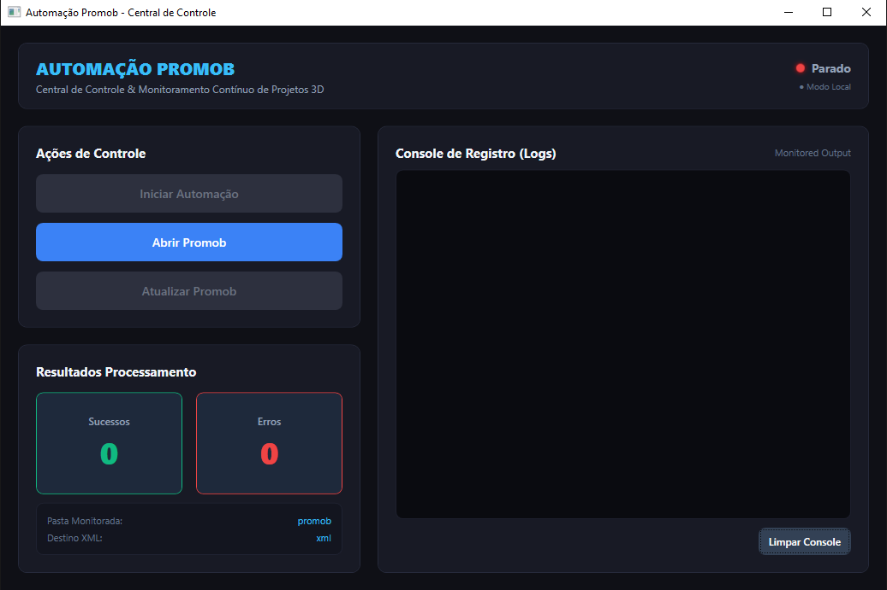
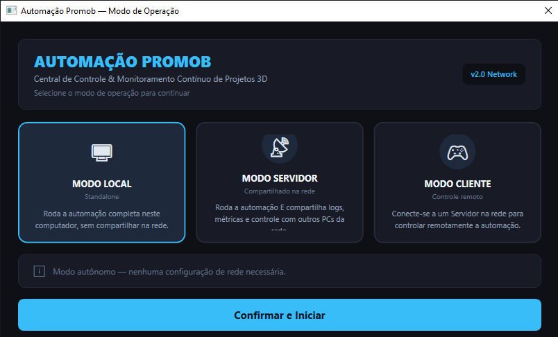
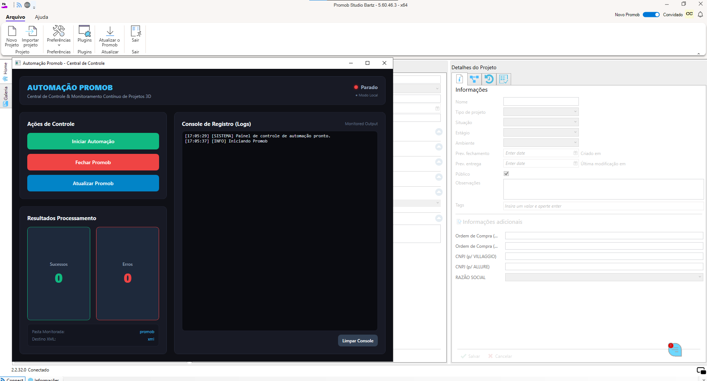
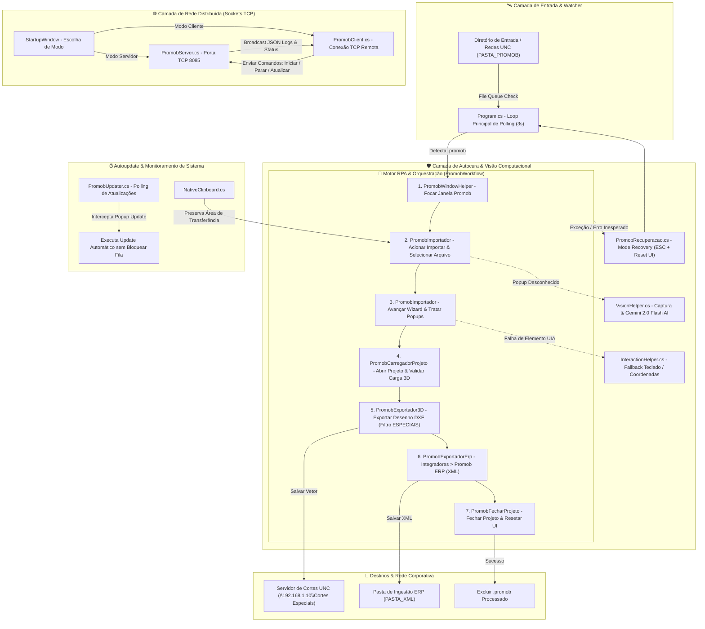

<div align="center">

# 🏗️ Automação Promob

### Sistema Industrial de Automação RPA, Visão Computacional Multimodal e Controle Remoto Distribuído para Promob 3D

[](https://dotnet.microsoft.com/)
[](https://docs.microsoft.com/en-us/dotnet/csharp/)
[](https://docs.microsoft.com/en-us/dotnet/desktop/wpf/)
[](https://github.com/FlaUI/FlaUI)
[](https://openrouter.ai/)
[](https://dotnet.microsoft.com/)
[](https://www.microsoft.com/windows)
[](#)

---

*Uma solução robótica industrial (RPA) de missão crítica, alta resiliência e controle remoto distribuído, desenvolvida para automatizar a ingestão de projetos 3D do Promob, preenchimento autônomo de wizards, exportação de arquivos vetoriais DXF para máquinas CNC e relatórios de engenharia XML para ERP no chão de fábrica.*

</div>

---

## 📸 Preview da Interface

<div align="center">
  
  
  
</div>

---

## 📌 Resumo Executivo & Contexto de Negócio

No ecossistema fabril da indústria moveleira, os projetos de ambientes planejados desenvolvidos pelos projetistas no software **Promob 3D** necessitam ser processados e convertidos em dois insumos fundamentais para a produção: **arquivos vetoriais CAD (.DXF)** para seccionadoras e centros de usinagem CNC (como camadas de cortes especiais) e **arquivos de estrutura de engenharia (.XML)** para envio de suprimentos e precificação no ERP corporativo.

Historicamente, a operação manual de abrir cada arquivo `.promob`, navegar por wizards complexos de importação, lidar com popups intermitentes, selecionar camadas específicas de usinagem e exportar relatórios gerava **gargalos operacionais**, **atrasos na liberação de lotes de corte**, **erros humanos no preenchimento de formulários** e **paralisações por travamento do software Promob**.

O **Automação Promob** é uma aplicação **Desktop C#/.NET 8 de Missão Crítica** que atua como um robô autônomo de alta resiliência. Ele monitora continuamente pastas de rede, orquestra a interface do Promob via **Windows UI Automation (UIA3 via FlaUI)**, utiliza **Visão Computacional assistida por IA Multimodal (Gemini 2.0 Flash)** para diagnóstico visual de telas não documentadas, permite monitoramento e controle remoto em tempo real através de **Sockets TCP distribuídos**, e conta com um **mecanismo autônomo de autocura (Recovery Mode / Self-Healing)** para garantir operação contínua 24/7 sem intervenção humana.

---

## ⚙️ Arquitetura de Software & Design Patterns

A aplicação foi desenvolvida com padrões rigorosos de engenharia de software desktop e automação industrial, priorizando **resiliência a falhas de interface, concorrência segura, desacoplamento de rede e recuperação autônoma**.



### 🏢 Modelo de Arquitetura Multicamada & Padrões Aplicados

* **RPA Híbrido em 3 Níveis (FlaUI / UIA3 + Coordenadas Dinâmicas + Fallback Teclado):**
  * **Nível 1 (UIA3 via FlaUI):** Inspeciona a árvore de acessibilidade nativa do Windows para identificar botões, seletores e menus por IDs únicos (`AutomationId`, `Name`). Independe da resolução da tela ou posição da janela.
  * **Nível 2 (Cliques em Coordenadas Dinâmicas):** Para telas de desenho 3D ou elementos proprietários do Promob que não expõem a árvore UIA, calcula o retângulo delimitador (`BoundingRectangle`) e simula cliques físicos relativos.
  * **Nível 3 (Fallback de Teclado & Clipboard):** Envia atalhos nativos de baixo nível (`Space`, `Enter`, `Tab`, `ESC`) e injeção controlada via Clipboard preservado caso a árvore de interface pare de responder.

* **Visão Computacional Multimodal (Oráculo AI - Gemini 2.0 Flash):**
  * O módulo `VisionHelper.cs` realiza screenshots da janela do Promob em momentos de dúvida ou exceção de interface, enviando a imagem via API HTTP para a LLM multimodal **Gemini 2.0 Flash** (via OpenRouter).
  * A IA analisa a tela, identifica mensagens de erro ou popups não documentados e retorna instrução estruturada de qual ação tomar, permitindo contornar exceções visuais que quebrariam automações convencionais.

* **Arquitetura Remota Distribuída (TCP Server/Client Protocol):**
  * Módulo nativo em C# baseado em `System.Net.Sockets` com serialização de mensagens JSON (`WsMessage.cs`).
  * **Modo Servidor:** Executa na máquina fabril onde o Promob está instalado, transmitindo telemetria de logs, contadores e status de execução em tempo real.
  * **Modo Cliente:** Permite que engenheiros e supervisores de qualquer computador da rede interna acompanhem a fila de produção e enviem comandos de controle (`START`, `STOP`, `UPDATE`) à distância.

* **Sistema de Autocura & Gestão de Recursos (Self-Healing & Clipboard Protection):**
  * **Preservação de Clipboard (`NativeClipboard.cs`):** Faz backup em memória da área de transferência do sistema operacional do usuário antes de realizar colar de caminhos de arquivos, restaurando os dados originais após a ação.
  * **Recovery Mode (`PromobRecuperacao.cs`):** Qualquer erro não tratado dispara o protocolo de emergência, que fecha janelas modais via `ESC`, reseta a interface ao estado inicial e reconfigura o foco do Promob para o próximo item da fila.

---

## ⚡ Funcionalidades Principais em Detalhes

### 1. 🛰️ Monitoramento & Ingestão Autônoma de Arquivos `.promob`
* **Loop de Inspeção Resiliente:** Polling contínuo em diretório configurado via `.env` (`PASTA_PROMOB`) ou pasta padrão na Área de Trabalho.
* **Validação de Trava de Arquivo:** Certifica-se de que o arquivo `.promob` terminou de ser copiado pela rede antes de iniciar a automação.
* **Limpeza Pós-Sucesso:** Exclui com segurança o arquivo processado da pasta de entrada para evitar reprocessamento.

---

### 2. 🤖 Workflow de Automação Industrial em 9 Etapas

O orquestrador `PromobWorkflow.cs` executa sequencialmente 9 passos estruturados:

| Etapa | Ação da Automação | Mecanismo de Execução | Impacto Evitado |
| :--- | :--- | :--- | :--- |
| **1. Localizar/Focar Janela** | Garante foco no processo `Promob.exe` | `PromobWindowHelper` / Win32 APIs | Envio de comandos para janelas erradas em background. |
| **2. Acionar Importar** | Navega até o menu de importação | Atalhos de teclado + UIA3 Menu Click | Erros de clique fora da área útil da janela. |
| **3. Seleção de Arquivo** | Injeta o caminho completo do `.promob` | Digitação UIA + Clipboard Fallback | Interrupção do fluxo por modal de diálogo nativo do Windows. |
| **4. Avanço de Wizard** | Percorre as etapas do assistente de importação | `InteractionHelper` com Polling Robusto | Parada do fluxo em botões "Avançar/Concluir". |
| **5. Tratamento de Popups** | Detecta e fecha modais de "Novo Projeto / Substituir" | Interceptador UIA multi-janela + AI Vision | Bloqueio da automação por popups de confirmação. |
| **6. Carga do Ambiente 3D** | Aguarda a renderização completa do projeto | `PromobCarregadorProjeto` + Polling de Estado | Exportação de arquivos parciais ou corrompidos. |
| **7. Exportação DXF 3D** | Gera o desenho vetorial CAD | `PromobExportador3D` + Filtro da Camada `ESPECIAIS` | Envio de camadas desnecessárias (piso/parede) para a CNC. |
| **8. Exportação ERP XML** | Gera a estrutura de engenharia XML | Navegação via `Integradores > Promob ERP` | Falha na integração de materiais e preços com o ERP. |
| **9. Fechar & Reset UI** | Encerra o projeto ativo e limpa a tela | `PromobFecharProjeto` + Verificação de Tela Limpa | Acúmulo de projetos abertos gerando vazamento de memória. |

---

### 3. 👁️ Visão Computacional Assistida por IA (Gemini 2.0 Flash)

Para lidar com a imprevisibilidade de interfaces legadas e avisos não catalogados do Promob:

* **Integração OpenRouter API:** O módulo `VisionHelper.cs` envia a imagem recortada da tela para o modelo **Gemini 2.0 Flash**.
* **Oráculo de Interface:** A IA determina se a tela contém um erro impeditivo, um aviso ignorável ou uma solicitação de salvamento.
* **Degradação Graciosa:** Caso ocorra falha de internet ou ausência da chave `GEMINI_API_KEY`, o sistema alterna automaticamente para as regras estáticas baseadas em UIA3 sem parar o robô.

---

### 4. 📐 Exportação DXF Seletiva & Integração com Rede de Cortes

* **Filtragem Seletiva de Camadas:** Na janela de exportação DXF, o robô desmarca automaticamente todas as camadas padrão (`Default`, `Piso`, `Parede`, `Cotas`) e marca exclusivamente a camada **`ESPECIAIS`**.
* **Renomeação e Roteamento UNC:** Salva o arquivo `.dxf` mantendo o mesmo nome base do `.promob` de entrada diretamente no compartilhamento de rede do setor de usinagem (ex: `\\192.168.1.10\Cortes Especiais`).

---

### 5. 🌐 Controle Remoto Distribuído via Sockets TCP

* **Comunicação Multiprocesso/Multimáquina:** Permite separar a execução do Promob do controle operacional.
* **Transmissão de Console ao Vivo:** O servidor envia cada linha de log formatada em JSON (`WsMessage`) instantaneamente para os clientes conectados.
* **Comandos Remotos com Autenticação:** Clientes podem disparar ações como `PAUSE`, `RESUME`, `TRIGGER_UPDATE` ou reconfiguração de parâmetros à distância.

---

### 6. 🔄 Monitoramento e Ingestão de Atualizações (Promob Update)

* **Daemon de Segundo Plano:** `PromobUpdater.cs` monitora a aparição de modais do "Promob Update" em momentos ociosos.
* **Atualização Autônoma:** Detecta notificações de atualizações de catálogo ou sistema, dispara o processo de download/instalação e fecha as janelas de conclusão sem bloquear a fila principal de processamento de projetos.

---

### 7. 🛡️ Sistema Autônomo de Recuperação (Self-Healing Mode)

* **Protocolo de Reset Em Movimento:** Ao identificar um timeout de interface ou exceção de automação, o sistema entra em modo de autocura (`PromobRecuperacao.cs`).
* **Sequência de Desobstrução:**
  1. Dispara múltiplos comandos `ESC` para fechar modais travados.
  2. Garante o fechamento da janela de projetos sem salvar alterações pendentes.
  3. Registra a exceção no arquivo `erros.log` com stack trace e timestamp.
  4. Retoma a leitura da pasta para o próximo item da fila.

---

## 🏛️ Estrutura do Código Fonte

```text
Automacao-Promob/
 ├── 🖥️ Program.cs                   # Ponto de entrada da aplicação e loop principal de polling
 ├── ⚙️ AppMode.cs                   # Enumeração e gerenciamento dos modos (Local, Servidor TCP, Cliente TCP)
 ├── 📊 AutomacaoEstado.cs           # Persistência de métricas de processamento (sucessos, erros, tempos)
 ├── 👁️ VisionHelper.cs              # Módulo de visão computacional multimodal via API Gemini 2.0 Flash
 ├── 🎨 MainWindow.xaml / .cs        # Painel principal de controle WPF (Console de logs e KPIs)
 ├── 🚀 StartupWindow.xaml / .cs     # Tela de inicialização e seleção do modo de operação/rede
 ├── 🔐 LoginWindow.xaml / .cs       # Interface de autenticação de operadores para ações de controle
 ├── 📄 network.example.json         # Modelo de exemplo para configuração de portas e IPs TCP
 ├── 📄 network.json                 # Arquivo de configuração de rede local (ignorado pelo Git)
 ├── 📂 Promob/                      # Regras de Negócio e Orquestração do Promob
 │    ├── ⚡ PromobWorkflow.cs        # Orquestrador mestre do fluxo de 9 etapas
 │    ├── ⚙️ PromobConfig.cs          # Mapeamento central de IDs UIA, nomes de janelas e caminhos
 │    ├── 🔍 PromobWindowHelper.cs    # Localização, tratamento de foco e busca de janelas e popups Win32
 │    ├── 🔄 PromobUpdater.cs         # Interceptador e executor autônomo do Promob Update
 │    ├── 📥 PromobImportador.cs      # Automação do wizard de importação de arquivos .promob
 │    ├── 📐 PromobCarregadorProjeto.cs # Validação de carga e estabilização do ambiente 3D
 │    ├── ✏️ PromobExportador3D.cs    # Exportador de arquivos vetoriais DXF com seleção da camada ESPECIAIS
 │    ├── 📄 PromobExportadorErp.cs   # Exportador de estruturas de engenharia XML para o ERP
 │    ├── 🚪 PromobFecharProjeto.cs   # Encerramento seguro de projetos e sanitização de tela
 │    ├── 🛡️ PromobRecuperacao.cs     # Mecanismo de autocura (Recovery Mode) para reset de interface
 │    └── 🚨 PromobExportException.cs # Definição de exceções personalizadas de engenharia do Promob
 ├── 📂 Automation/                  # Motor Genérico de Automação de Interface
 │    ├── 🔎 WindowFinder.cs          # Motor de busca UIA3 resiliente com cache e navegação em árvore
 │    └── 🖱️ InteractionHelper.cs     # Emulação robusta de cliques, digitação, foco e fallbacks
 ├── 📂 Network/                     # Camada de Comunicação Distribuída via TCP Sockets
 │    ├── ⚙️ NetworkSettings.cs       # Carregador e salvador de parâmetros de conexão de rede
 │    ├── 🖥️ PromobServer.cs          # Servidor TCP (Broadcast de logs em tempo real e receptor de comandos)
 │    ├── 💻 PromobClient.cs          # Cliente TCP (Receptor de logs e emissor de comandos remotos)
 │    └── 📦 WsMessage.cs             # DTO estruturado das mensagens JSON trafegadas na rede
 └── 📂 Utils/                       # Utilitários de Infraestrutura e Diagnóstico
      ├── 📜 AppLogs.cs               # Central de log em disco e formatação de exceções
      ├── 🪵 Logger.cs                # Formatação de mensagens para console e evento OnLog para WPF UI
      ├── ⏱️ Diagnostics.cs           # Medidor de tempo de execução e marcadores de performance
      └── 📋 NativeClipboard.cs       # Gerenciador seguro de área de transferência com backup/restore
```

---

## 💻 Instalação & Desenvolvimento

### Pré-requisitos

* **Sistema Operacional:** Windows 10 ou Windows 11 (64-bit)
* **Runtime / SDK:** [.NET 8.0 SDK](https://dotnet.microsoft.com/download/dotnet/8.0)
* **Promob 3D:** Instalado e devidamente licenciado na máquina de execução

### 1. Clonar o Repositório

```bash
git clone https://github.com/betolara1/Automacao-Promob.git
cd Automacao-Promob
```

### 2. Configurar Variáveis de Ambiente (`.env`)

Crie um arquivo `.env` na raiz do projeto baseado na estrutura abaixo:

```env
# API Key do OpenRouter / Gemini para Visão Computacional (opcional)
GEMINI_API_KEY=sua_chave_openrouter_aqui

# Caminhos das pastas de trabalho (opcional - utilizará a Área de Trabalho se omitido)
PASTA_PROMOB=C:\Users\Nome\Desktop\promob
PASTA_XML=C:\Users\Nome\Desktop\xml
```

### 3. Configurar Rede Distribuída (`network.json`)

Copie o arquivo de exemplo `network.example.json` para `network.json`:

```powershell
copy network.example.json network.json
```

Conteúdo padrão do `network.json`:
```json
{
  "port": 8085,
  "recentServerIps": []
}
```

### 4. Executar em Modo de Desenvolvimento

```powershell
dotnet run
```

---

## 📦 Build de Produção

Para gerar o executável binário compilado, autocontido (que não exige a instalação prévia do runtime .NET na máquina de destino) e pronto para operação 24/7:

```powershell
dotnet publish -c Release -r win-x64 --self-contained true -p:PublishSingleFile=true -o ./publish
```

O arquivo executável será gerado no diretório `./publish/PromobAutomacao.exe`.

### Configuração no Agendador de Tarefas do Windows (Operação 24/7):

1. Abra o **Agendador de Tarefas** (`taskschd.msc`).
2. Clique em **Criar Tarefa Básica...**
3. **Gatilho:** Selecione **"Ao iniciar o sistema"** (para inicialização automática com o Windows).
4. **Ação:** Selecione **"Iniciar um programa"** e insira o caminho do `PromobAutomacao.exe`.
5. Nas propriedades da tarefa, marque:
   * **"Executar estando o usuário conectado ou não"**
   * **"Executar com privilégios mais altos"** (Necessário para controle de janelas UIA3 Win32).
6. Certifique-se de que os arquivos `.env` e `network.json` estejam na mesma pasta do executável `./publish/`.

---

## 🛡️ Resiliência & Preservação de Recursos (Self-Healing)

Em ambientes de chão de fábrica com operação ininterrupta, instabilidades na interface são contornadas por mecanismos nativos:

* **Preservação do Clipboard (`NativeClipboard.cs`):** Salva o conteúdo anterior da área de transferência do Windows antes de colar caminhos de arquivos e restaura o conteúdo original imediatamente após a digitação.
* **Detecção Multi-Estratégia de Janelas:** Janelas modais críticas (ex: *"Não há módulos para exportar"*) são localizadas através de múltiplos pontos da árvore UIA (Desktop, janela principal e filhas) sem dependência do `ProcessId`, que é zero em diálogos nativos Win32.
* **Recovery Mode Autônomo:** Se qualquer etapa falhar por mais de 3 tentativas, o `PromobRecuperacao.cs` reseta a interface enviando teclas `ESC`, fechando o projeto sem salvar e liberando a memória para o próximo item.

---

## 🛠️ Stack Tecnológica

| Categoria | Tecnologia | Versão / Biblioteca | Aplicação |
| :--- | :--- | :--- | :--- |
| **Linguagem Principal** | **C#** | `.NET 8.0` / C# 12 | Desenvolvimento completo do core e regras de automação |
| **Interface Gráfica** | **WPF** | XAML / Dark Theme | Painel de controle, logs em tempo real e telas de logon/modo |
| **Automação RPA** | **FlaUI.UIA3** | `v4.0.0` | Inspeção e controle da árvore de acessibilidade do Windows |
| **Visão Computacional** | **OpenRouter API** | `Gemini 2.0 Flash` | Diagnóstico e análise de popups desconhecidos via IA |
| **Rede & Sockets** | **System.Net.Sockets** | Nativo .NET | Comunicação remota TCP Servidor/Cliente e sincronização |
| **Serialização** | **System.Text.Json** | Nativo .NET | Formatador e parser das mensagens de telemetria de rede |
| **Variáveis de Ambiente**| **DotNetEnv** | `v3.1.1` | Leitura dinâmica do arquivo de configuração `.env` |
| **Captura de Imagem** | **System.Drawing.Common**| Nativo .NET | Screen capture de janelas para validação com AI Vision |

---

## 🔧 Troubleshooting

### O popup X apareceu mas o robô não fechou
Verifique o arquivo de log para encontrar a linha de diagnóstico:
```text
[DIAGNÓSTICO] Janelas abertas no momento da verificação do popup: 'Exportar' (PID=0) | ...
```
Esta mensagem indica que a janela foi mapeada pelo Windows mas não casou com os seletores UIA. Adicione a propriedade `AutomationId` ou `Name` correspondente em `PromobConfig.cs`.

### Onde ficam os logs de erro?
O arquivo `erros.log` é gerado automaticamente no mesmo diretório do executável (`publish/` ou `bin/Debug/net8.0-windows/`). Ele contém os stack traces completos com timestamps de todas as exceções capturadas.

### A visão computacional por IA não responde
Certifique-se de que a variável `GEMINI_API_KEY` está configurada corretamente no arquivo `.env` e de que a máquina possui conexão à internet. Na ausência da chave, o sistema opera normalmente utilizando os fallbacks de interface baseados em UIA.

---

## ⚠️ Limitações Conhecidas

- **Plataforma Windows Exclusiva:** Depende de APIs Win32 (`user32.dll`) e da arquitetura Windows UI Automation (UIA3) — indisponível em Linux/macOS.
- **Idioma e Versão do Promob:** Os seletores de interface são calibrados para o software Promob em **Português (BR)**.
- **Resolução e Escalonamento DPI:** Testado e otimizado para resolução **Full HD (1920x1080)** com escala de exibição em **100%**.
- **Instância Única:** O robô orquestra uma única instância ativa do `Promob.exe`. Execuções simultâneas em paralelo na mesma sessão não são suportadas.
- **Sessão de Usuário Ativa:** Exige uma sessão de usuário do Windows ativa com área de trabalho renderizada (não roda em sessões RDP minimizadas ou bloqueadas sem emulação de display).

---

## 👨‍💻 Autor & Engenharia de Desenvolvimento

Desenvolvido por **Beto Lara** — *Backend & Desktop Software Engineer*

[](https://github.com/betolara1)

---

<div align="center">

**Automação Promob** — *Engenharia de Automação de Alta Resiliência Garantindo a Continuidade e Precisão do Chão de Fábrica.*

> **Nota:** Este projeto utiliza o agente de inteligência artificial **Antigravity** (Google DeepMind) para aceleração de desenvolvimento, arquitetura de sistemas, refinamento estético de interface e garantia de conformidade com boas práticas de engenharia de software.

</div>
