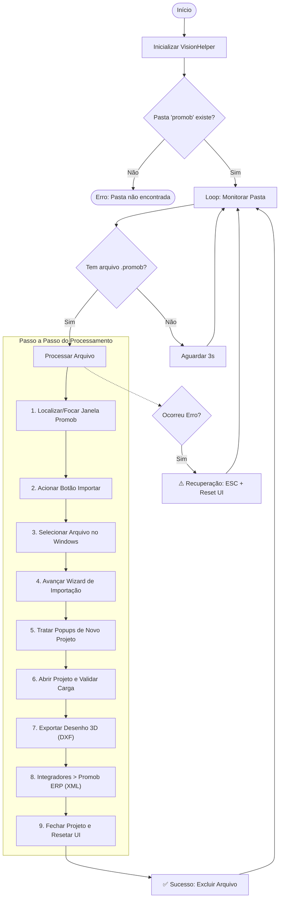

# Automação Promob

   

**Automação robótica (RPA) de alta resiliência e controle remoto distribuído para processamento de projetos no software Promob.**

O projeto automatiza o ciclo completo de processamento de projetos 3D do Promob: monitoramento de diretórios, importação de arquivos `.promob`, preenchimento resiliente de wizards, geração de exportações XML para ERP, exportação de desenhos 3D (DXF) e reset seguro de interface.

Além disso, conta com uma **arquitetura de rede distribuída** que permite monitorar e controlar a automação remotamente via TCP.

---

## Índice

- [Interface do Usuário](#-interface-do-usuário)
- [Fluxo de Funcionamento](#-fluxo-de-funcionamento-e-ciclo-de-vida)
- [Arquitetura e Decisões de Engenharia](#️-arquitetura-e-decisões-de-engenharia)
- [Resiliência e Autocura](#️-resiliência-e-autocura-self-healing)
- [Stack Técnica](#️-stack-técnica)
- [Como Configurar e Rodar](#-como-configurar-e-rodar)
- [Build de Produção](#-build-de-produção)
- [Estrutura do Projeto](#-estrutura-detalhada-do-projeto)
- [Troubleshooting](#-troubleshooting)
- [Limitações Conhecidas](#-limitações-conhecidas)

---

## 📸 Interface do Usuário

O painel do operador foi construído em WPF com Dark Theme, feedback visual em tempo real e separação clara de contextos:

| 🖥️ 1. Seleção de Modo (`StartupWindow`) | 🔐 2. Autenticação (`LoginWindow`) | 📊 3. Painel de Controle (`MainWindow`) |
|:---:|:---:|:---:|
|  |  |  |
| Define se a instância rodará localmente, como servidor TCP ou como cliente remoto. | Restringe ações de controle (Iniciar/Parar/Atualizar) a operadores autenticados. | Console de logs em tempo real, contadores de performance (sucessos/erros) e controles manuais. |

---

## 📐 Fluxo de Funcionamento e Ciclo de Vida



---

## ⚙️ Arquitetura e Decisões de Engenharia

### 1. Motor de Automação de Interface (RPA Híbrido)
Diferente de automações simples baseadas em coordenadas fixas, este robô usa **3 níveis de resiliência**:

- **Nível 1 — Windows UI Automation (UIA3 via FlaUI):** inspeciona a árvore de acessibilidade nativa do SO para identificar botões, campos e menus pelos seus identificadores únicos. Independente de resolução ou posicionamento de janela.
- **Nível 2 — Cliques em Coordenadas Dinâmicas:** quando um componente não expõe elementos UIA (ex: canvas 3D), o robô calcula coordenadas relativas com base no `BoundingRectangle` e executa clique físico simulado.
- **Nível 3 — Fallback de Teclado:** como última camada, emula atalhos de baixo nível (`Space`, `Enter`, `Tab`, `ESC`) caso a interface pare de responder a eventos UIA.

### 2. Visão Computacional Multimodal (AI-Assisted Vision)
- Para telas de aviso inesperadas ou renderizações 3D complexas, o projeto integra o `VisionHelper.cs`.
- Realiza capturas de tela e consulta **LLMs Multimodais (Gemini 2.0 Flash via OpenRouter)** como oráculo visual — validações que seriam impossíveis com regras estáticas (ex: verificar se um modal de aviso com padrão visual não documentado está presente).
- Quando a API não está disponível, o sistema degrada graciosamente para estratégias baseadas em UIA.

### 3. Arquitetura de Rede Distribuída (Servidor-Cliente TCP)
Módulo de comunicação via sockets TCP com mensagens JSON estruturadas:

- **Modo Servidor:** o robô executa na máquina com Promob instalado, abrindo uma porta TCP para transmitir logs em tempo real e receber comandos remotos.
- **Modo Cliente:** outros computadores na rede conectam-se ao servidor, recebem o console de logs ao vivo e enviam comandos (Iniciar, Parar, Atualizar).
- **Modo Local:** execução standalone (automação e interface na mesma máquina).

### 4. Gerenciamento de Processos e Recursos
- **Controle do ciclo de vida do Promob:** a `MainWindow` monitora o processo `Promob.exe` em background, controlando parada/inicialização e evitando vazamentos de recursos.
- **Monitor de Atualizações:** threads dedicadas interceptam modais do "Promob Update" em momentos ociosos e executam o fluxo completo de atualização (verificar status → baixar → instalar → fechar popup de conclusão) de forma automática.
- **Limpeza de Janelas Órfãs:** diálogos inesperados e popups de aviso são interceptados e encerrados automaticamente.

### 5. Exportação de Desenhos 3D (DXF) Customizados
- **Renomeação Dinâmica:** o `.dxf` gerado recebe o mesmo nome do `.promob` de entrada.
- **Destino de Rede:** arquivos DXF são salvos diretamente num caminho de rede corporativo (ex: `\\192.168.1.10\Cortes Especiais`), integrando ao fluxo de corte físico.
- **Filtragem Seletiva de Camadas:** desmarca todas as camadas padrão (Default, Piso, Parede, etc.) e seleciona exclusivamente a camada `ESPECIAIS`.
- **Resiliência no Preenchimento de Campos:** se o `ValuePattern` do UIA falhar, executa alternativas via emulação de teclado e injeção direta no Clipboard.

---

## 🛡️ Resiliência e Autocura (Self-Healing)

Em produção 24/7, falhas externas são inevitáveis. O projeto foi blindado com:

- **Preservação do Clipboard (`NativeClipboard.cs`):** faz backup da área de transferência do usuário antes de injetar caminhos de arquivo, restaurando ao fim da operação.
- **Bypass de Atualizações (`PromobUpdater.cs`):** intercepta modais de atualização de catálogos no startup, descartando-os de forma segura para não bloquear o processamento.
- **Modo de Recuperação (Recovery Mode):** qualquer falha ativa o `PromobRecuperacao.cs`, que envia sequências de `ESC`, fecha popups abertos e reseta o Promob ao estado inicial — garantindo que o próximo arquivo da fila seja processado normalmente.
- **Detecção Multi-Estratégia de Janelas:** popups críticos (ex: MessageBox "Não há módulos para exportar") são buscados em múltiplos pontos da hierarquia UIA (Desktop, janela principal, janelas-filhas) sem dependência de `ProcessId`, que frequentemente é zero em diálogos nativos do Windows.

---

## 🛠️ Stack Técnica

| Categoria | Tecnologia |
|---|---|
| Linguagem | C# (.NET 8.0) |
| Framework UI | WPF (Windows Presentation Foundation) |
| Automação de Interface | FlaUI.UIA3 |
| Captura de Tela | System.Drawing.Common |
| Comunicação de Rede | System.Net.Sockets (TCP) |
| Serialização | System.Text.Json |
| Configuração | DotNetEnv (arquivo `.env`) |
| Inteligência Artificial | OpenRouter API — Gemini 2.0 Flash |

---

## 🚀 Como Configurar e Rodar

### Pré-requisitos
1. Windows 10 ou 11
2. [SDK .NET 8.0](https://dotnet.microsoft.com/download/dotnet/8.0)
3. Promob instalado e licenciado

### 1. Clonar o repositório
```bash
git clone git@github.com:betolara1/Automacao-Promob.git
cd Automacao-Promob
```

### 2. Configurar variáveis de ambiente (`.env`)
Crie um arquivo `.env` na raiz do projeto:
```env
# API Key do OpenRouter/Gemini para visão computacional (opcional — sistema funciona sem ela)
GEMINI_API_KEY=sua_chave_aqui

# Pastas monitoradas (opcional — usa pastas padrão na Área de Trabalho se omitido)
PASTA_PROMOB=C:\Users\Nome\Desktop\promob
PASTA_XML=C:\Users\Nome\Desktop\xml
```

### 3. Configurar rede (`network.json`)
Copie o arquivo de exemplo e preencha com suas configurações:
```bash
cp network.example.json network.json
```
```json
{
  "port": 8085,
  "recentServerIps": []
}
```
> O `network.json` é ignorado pelo Git (`.gitignore`).

### 4. Rodar em desenvolvimento
```powershell
dotnet run
```

---

## 📦 Build de Produção

Para rodar 24/7 via Agendador de Tarefas do Windows, gere um executável único autocontido:

```powershell
dotnet publish -c Release -r win-x64 --self-contained true -p:PublishSingleFile=true -o ./publish
```

O executável gerado em `./publish/PromobAutomacao.exe` não exige .NET instalado na máquina de destino.

**Configurar no Agendador de Tarefas:**
1. Abrir **Agendador de Tarefas** → Criar Tarefa Básica
2. Gatilho: **Ao iniciar o sistema** (para iniciar automaticamente com o Windows)
3. Ação: iniciar programa → apontar para `PromobAutomacao.exe`
4. Marcar **"Executar estando o usuário conectado ou não"** e **"Executar com privilégios mais altos"**
5. Garantir que o `.env` e o `network.json` estejam na mesma pasta do `.exe`

---

## 📁 Estrutura Detalhada do Projeto

```text
Automacao-Promob/
├── Program.cs                   # Ponto de entrada e loop principal de monitoramento
├── AppMode.cs                   # Modos de inicialização (Local, Servidor, Cliente)
├── AutomacaoEstado.cs           # Persistência de estado e estatísticas de processamento
├── VisionHelper.cs              # Visão computacional via Gemini 2.0 Flash
├── MainWindow.xaml / .cs        # Painel de controle do operador (WPF)
├── StartupWindow.xaml / .cs     # Seleção de modo de rede na inicialização
├── LoginWindow.xaml / .cs       # Autenticação do operador
├── network.example.json         # Exemplo de configuração de rede (versionar este)
├── network.json                 # Configuração real com credenciais (NÃO versionado)
├── Promob/                      # Regras de negócio e etapas da automação
│   ├── PromobWorkflow.cs        # Orquestrador das 9 etapas principais
│   ├── PromobConfig.cs          # IDs de elementos UIA, nomes e caminhos configuráveis
│   ├── PromobWindowHelper.cs    # Localização e foco de janelas e popups
│   ├── PromobUpdater.cs         # Fluxo completo de atualização automática do Promob
│   ├── PromobImportador.cs      # Wizard de importação de arquivos .promob
│   ├── PromobCarregadorProjeto.cs  # Validação do ambiente 3D e carregamento
│   ├── PromobExportador3D.cs    # Exportação DXF com filtragem de camadas
│   ├── PromobExportadorErp.cs   # Exportação XML para ERP
│   ├── PromobFecharProjeto.cs   # Encerramento seguro e reset de tela
│   ├── PromobRecuperacao.cs     # Recovery Mode — tratamento de falhas inesperadas
│   └── PromobExportException.cs # Exceções de negócio para falhas na exportação ERP
├── Automation/                  # Ferramentas genéricas de automação de interface
│   ├── WindowFinder.cs          # Motor de busca UIA resiliente com cache e fallback
│   └── InteractionHelper.cs     # Clique, foco, digitação e polling robustos
├── Network/                     # Comunicação TCP entre máquinas
│   ├── NetworkSettings.cs       # IPs, portas e configurações de conexão
│   ├── PromobServer.cs          # Servidor TCP (logs ao vivo + recebe comandos)
│   ├── PromobClient.cs          # Cliente TCP (exibe logs + envia comandos)
│   └── WsMessage.cs             # Modelo JSON das mensagens trafegadas
└── Utils/                       # Utilitários de diagnóstico e sistema
    ├── AppLogs.cs               # Central de mensagens estruturadas de log
    ├── Logger.cs                # Formatação de console e evento OnLog para a UI
    ├── Diagnostics.cs           # Marcadores de tempo e métricas de performance
    └── NativeClipboard.cs       # Manipulação segura da área de transferência
```

---

## 🔧 Troubleshooting

### O popup X apareceu mas o robô não fechou

O log vai mostrar uma linha de diagnóstico:
```
[DIAGNÓSTICO] Janelas abertas no momento da verificação do popup: 'Exportar' (PID=0) | ...
```
Isso indica que a janela foi listada mas não casou com os critérios de detecção. Abra uma issue com essa linha de log para que o seletor seja ajustado.

### Onde ficam os logs de erro?

O arquivo `erros.log` é gerado automaticamente na mesma pasta do executável (`bin/Debug/...` em dev, `publish/` em produção). Ele contém stack traces completos de todas as exceções não tratadas, com timestamp.

### O robô travou num popup inesperado do Promob

O Recovery Mode (`PromobRecuperacao.cs`) é acionado automaticamente. Se mesmo assim travar, clique em **Parar** no painel e depois em **Iniciar** — o robô reseta o estado e retoma a fila do ponto onde parou.

### A visão computacional não está funcionando

Confirme que o `.env` contém `GEMINI_API_KEY` válida. Sem a chave o sistema opera normalmente, apenas sem as validações visuais assistidas por IA. Verifique o console por linhas com `[VISION] ⚠️`.

### O Promob Update não está sendo detectado ao final da atualização

O popup de conclusão pode aparecer com textos variados dependendo da versão do Promob. O log exibirá:
```
[SUCESSO] Conteúdo do popup de conclusão (para diagnóstico): 'NomeDoElemento' (Custom, Id=...) | ...
```
Envie essa linha para ajuste do seletor.

---

## ⚠️ Limitações Conhecidas

- **Windows only:** depende de APIs Win32 (`user32.dll`) e do Windows UI Automation — não roda em Linux/macOS.
- **Versão e idioma do Promob:** os seletores UIA são calibrados para o Promob em **português (BR)**. Versões muito antigas ou muito novas podem ter IDs de elementos diferentes.
- **Resolução e DPI:** testado em monitores Full HD (1920×1080) com DPI 100%. Escalonamento diferente pode deslocar coordenadas nos fallbacks por posição.
- **Uma instância por vez:** o robô assume que há exatamente uma janela do Promob aberta. Múltiplas instâncias simultâneas causam comportamento indefinido.
- **Sessão de usuário ativa:** a automação exige sessão Windows ativa com área de trabalho visível. Não funciona com sessão bloqueada ou via RDP sem redirecionamento de display.
